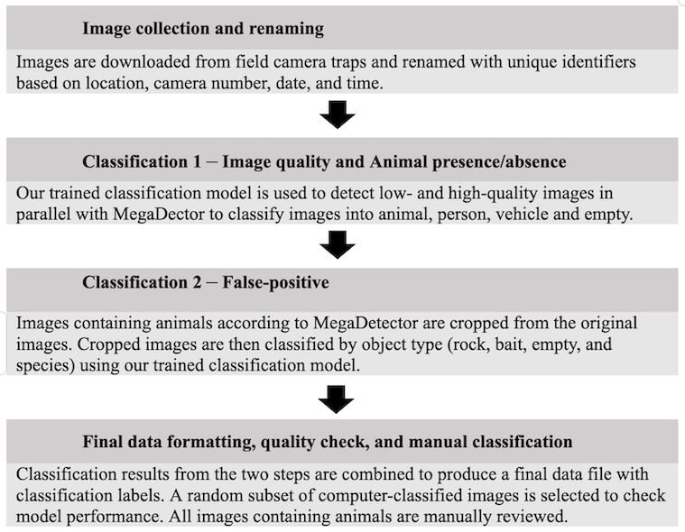
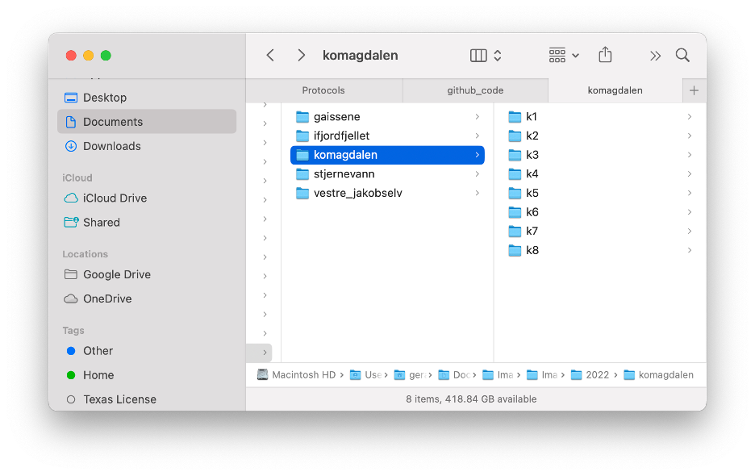
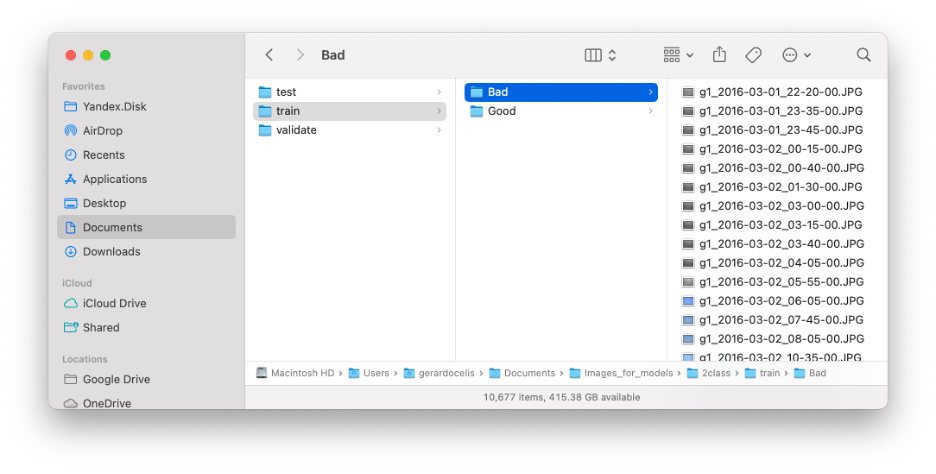
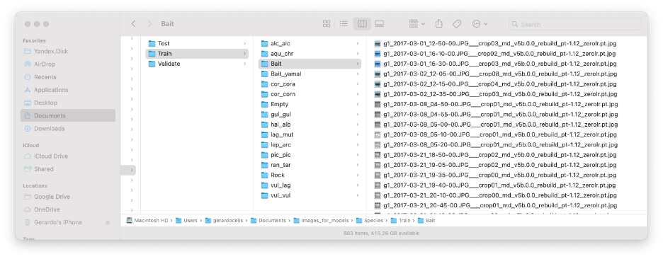

# Image classification workflow guide.

Celis et al. 2024, A versatile semi-automated image analysis workflow for time-lapse camera trap image classification.

## Table of contents

1. [Introduction](##Introduction)
2. [Step 1 file organization](#Step-1-file-organization)
3. [Step 2 image quality](#Step-2-image-quality)
    * [Model training](#Model-training)
    * [Image classification](#Image-classification)
4. [Step 3 MegaDetector](#Step-3-MegaDetector)
    * [Image classification](#Image-classification)
    * [Merging outputs](#Merging-outputs)
    * [Repeat detection elimination](#Repeat-detection-elimination)
5. [Step 4 False positive filter](#Step-4-False-positive-filter)
    * [Model training](#Model-training-1)
    * [Image classification](#Image-classification-1)

## Introduction

This repo contains a guide for the image classification workflow (Fig. 1) used in Celis et al 2024. General instructions are provided for each step of the workflow and there will be a corresponding file with code scripts or links to MegaDetector Python code. Each script will contain embedded instructions with more details for each step.

 Figure 1. Time-lapse camera trap workflow. Data preparation and model steps are adapted from Böhner et al. (2022).

Users may adapt the code to fit their specific needs. To run the code for each step of the workflow, you will need to install R, Python, and several packages/libraries. Please follow the instructions at each source, which will depend on your computer and operating system:
  * R; https://cran.r-project.org, we also suggest installing an IDE such as Rstudio; https://posit.co/downloads/.
  * Python; https://www.python.org
  * Tensorflow for R; https://tensorflow.rstudio.com/install/
  * MegaDetector; https://github.com/microsoft/CameraTraps/blob/main/megadetector.md#using-the-model

## Step 1 file organization
### Renaming files

Before running the renaming R script, you must organize your images into folders such that all images from one camera trap are contained in a single folder. In our specific case, we had sites that had multiple cameras. For example, the Komagdalen site had eight cameras, and each camera station had a unique name (k1 - k8; Fig. 2). Before applying the classification workflow, all images should have unique names that correspond to the site, camera, and timestamp. We provide a script for renaming images that extracts the camera locations from the names of the folders in a folder structure, as suggested in Fig. 2.

The image renaming script is: [Step_1_Rename_Files.R](Step_1_Rename_Files.R).

 Figure 2. Folder structure for each camera station.

## Step 2 image quality
### Model training
Model training for image quality can be performed using users' images based on the two classes, Bad and Good, or can be trained to include additional classes of interest. For example, one may be interested in identifying if a lure bait is present in the image. The R script for model training is [Step_2_A_Model_Training_ImageQuality.R](Step_1_Rename_Files.R). However, if you want to use our train model for image quality, proceed to the next section, “Image classification for image quality”.

Model training requires you have manually classified images and separated them into individual folders. For example, our image quality model has two classes ‘Good’ and ‘Bad’ quality. In addition, you will need images for training the model, validation during training and test model once it has been trained (Fig. 3). We split the data such that 90% of image were used to train the model, 8% for validation and 2% to evaluate (test).

 Figure 3. Folder structure for Image quality training (2 classes).

### Image classification

The image classification for image quality can be done with our model or with the model created by user in the previous section. Our classification script is [Step_2_B_Image_Classification.R](Step_2_B_Image_Classification.R) and the model can be is: [model_resnet50_ImageQuality.h5](https://drive.google.com/file/d/1ABIpJXt4jdRzjM_kPJoNyjdbC84LgNjt/view?usp=sharing). This step will produce a csv file with image file names, model scoring for each image and classification based on the scoring.
The classification of each image can be set as the maximum value of prediction scoring, or one can set the classification based on a threshold. See example below.

## Step 3 MegaDetector
### Image classification

MegaDetector was used to classify images that contained an animal, person, vehicle, or were empty. The MegaDetector will require you to use Python and install the MegaDetector GitHub repo on your computer, following the instructions mentioned in the introduction. Use the following code to run a batch of images for classification: [detection/run_detector_batch.py](https://github.com/agentmorris/MegaDetector/blob/main/detection/run_detector_batch.py). We used MegaDetector’s v5.0 (MDv5a) trained model to classify images. This step will produce a json file with image file names, model scoring for each image.

### Merging outputs
[api/batch_processing/postprocessing/merge_detections.py](https://github.com/agentmorris/MegaDetector/blob/main/api/batch_processing/postprocessing/merge_detections.py)

### Repeat detection elimination
[api/batch_processing/postprocessing/repeat_detection_elimination/find_repeat_detections.py](https://github.com/agentmorris/MegaDetector/blob/main/api/batch_processing/postprocessing/repeat_detection_elimination/find_repeat_detections.py)

[api/batch_processing/postprocessing/repeat_detection_elimination/remove_repeat_detections.py](https://github.com/agentmorris/MegaDetector/blob/main/api/batch_processing/postprocessing/repeat_detection_elimination/remove_repeat_detections.py)

### Output processing

After running Megadetector the json file with image scoring will be used to classify image and produce a csv file that will combine the image quality classifications. The R script for this step is: [Step_3_B_Megadetector_Classification_Output.R](Step_3_B_Megadetector_Classification_Output.R). This step will produce a csv file with image file names, model scoring for each image and classification based on the scoring in addition to the image quality.

### Cropping images

All images that were classified by Megadetector to have an animal will be used to identify the species and the number of individuals in each image. In order to do so, each individual animal in the image need to be cropped and classified. Cropping of images uses python script provided by Megadetector: [classification/crop_detections.py](https://github.com/agentmorris/MegaDetector/blob/main/classification/crop_detections.py).

## Step 4 False positive filter
### Model training

Model training for species can be performed by users include species of interest. The R script for model is: [Step_4_B_Crop_Training_FalsePositive.R](Step_4_B_Crop_Training_FalsePositive.R). However, if you would like to use our model, proceed to the next section, “Image classification for species”.
Model training requires you have manually classified images and separated them into individual folders. For example, our image quality model has sixteen classes. In addition, you will need images for training the model, validation during training and test model once it has been trained (Fig. 4). We split the data such that 90% of images were used to train the model, 8% for validation and 2% to evaluate (test).

 Figure 4. Folder structure for species model training (16 classes).

### Image classification

The image classification for species can be done with our model or with model created by user in the previous section. Our classification script is [Step_4_C_Crop_FalsePositive_Classification.R](Step_4_C_Crop_FalsePositive_Classification.R) and the model is: [model_resnet50_FalsePositive.h5](https://drive.google.com/file/d/1jKua9RyWclki7cVErjOGrZyy8c_fLRDv/view?usp=sharing). This step will produce a csv file with file names, model scoring for each image and classification based on the scoring.

## Step 5 Check classification

### Image sorting and check

After images have been classified by image quality, presence and absence of humans and animals, and classified to species, the images need to be sorted based on classification for manual scoring to determine model performance. A random subset of images for all classifications will be selected for manual scoring. The R script for this step is: [Step_5_A_sort_to_check.R](Step_5_A_sort_to_check.R).

### Compare Manual and Model scoring

After manually checking images, the scoring of images will be compared to model scoring to evaluate workflow. The R script for this is [Step_5_B_merge_manual_scored.R](Step_5_B_merge_manual_scored.R).
